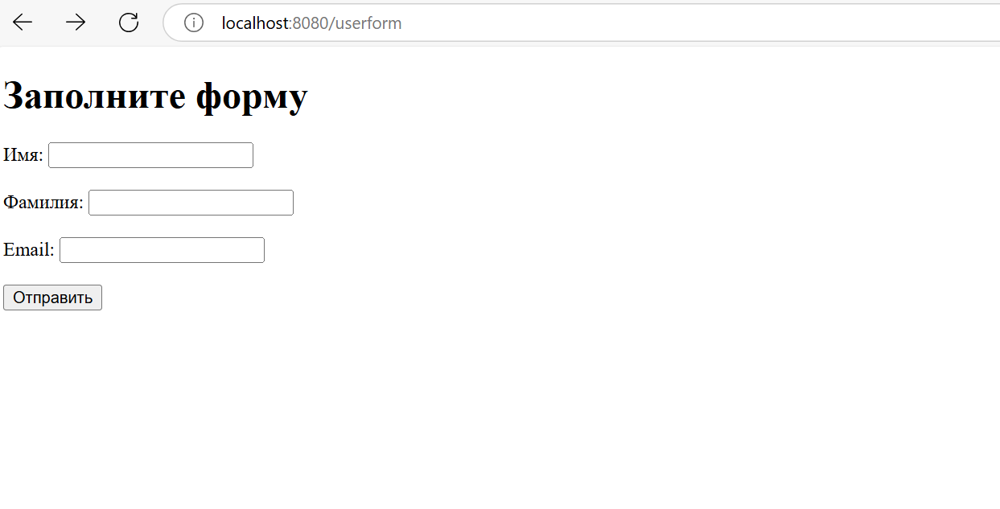
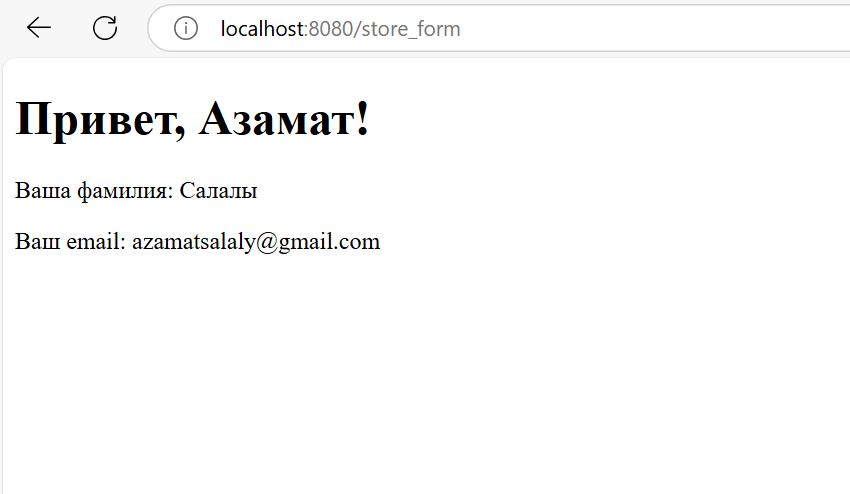

# Домашняя работа

## Что нужно сделать:

### Вам предстоит установить фреймворк Laravel и создать контроллер, содержащий экшены для вывода и обработки формы.

1. Установите Laravel с помощью composer, выполнив команду composer create-project laravel/laravel <имя проекта>. В поле <имя проекта> впишите имя вашего проекта. Этому имени будет соответствовать имя папки, в которую вы поместите проект.

2. Создайте контроллер для вывода формы на страницу и её обработки. В командную строку введите команду php artisan make:controller FormProcessor.

3. После выполнения команды убедитесь, что контроллер создан, — соответствующий файл должен появиться в папке app/Http/Controllers.

4. Внутри контроллера опишите метод index: он должен выводить в браузер форму для заполнения.
— Опишите форму в виде шаблона blade.
— Внутри формы должны быть поля для ввода имени, фамилии и email пользователя.
— Форма отправляется методом POST.
— Параметр action пока оставьте пустым.
— Не забудьте про CSRF.

5. Внутри файла /routes/web.php опишите новый роут (метод GET), который будет вызывать метод index контроллера FormProcessor по url /userform.

6. Запустите встроенный сервер Laravel командой php artisan serve --port=8080 и убедитесь, что форма выводится по адресу http://localhost:8080/userform.

7. В контроллере FormProcessor создайте метод store для обработки формы. Этот метод должен принимать поля формы и отправлять ответ в виде JSON-объекта, содержащего значения полей формы (имя, фамилия, email).

8. Внутри файла /routes/web.php опишите новый роут (метод POST), который будет вызывать метод store контроллера FormProcessor по url /store_form.

9. Отредактируйте поле action формы в шаблоне и укажите адрес /store_form.

10. Откройте форму в браузере по адресу http://localhost:8080/userform, заполните её и попробуйте отправить на сервер, нажав кнопку Submit. Если всё сделано правильно, вы увидите в браузере объект JSON.

11. Создайте новый шаблон blade для приветствия пользователя (например: «Привет, <имя>!»).

12. Измените метод store контроллера FormProcessor таким образом, чтобы вместо JSON он возвращал шаблон, заполненный данными пользователя.

